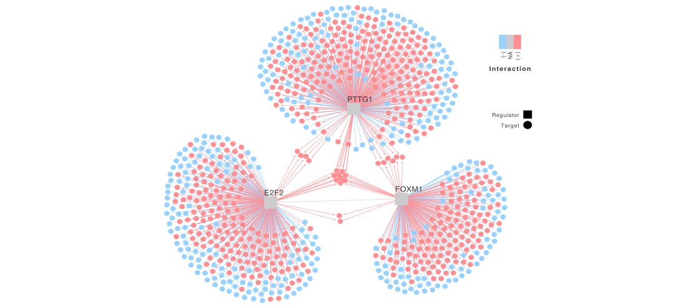
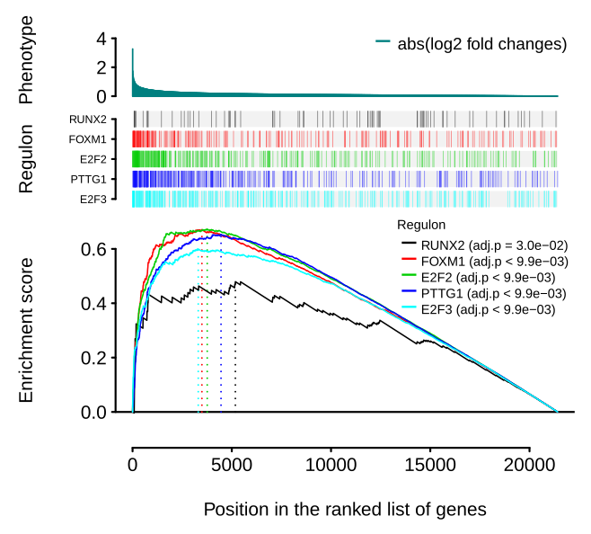
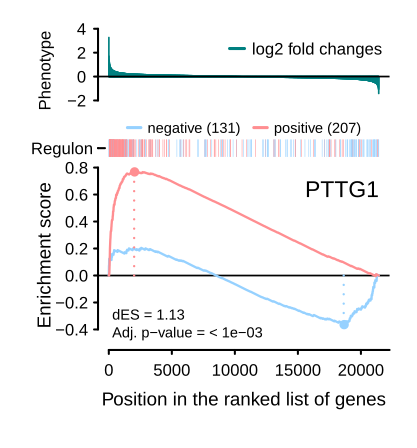
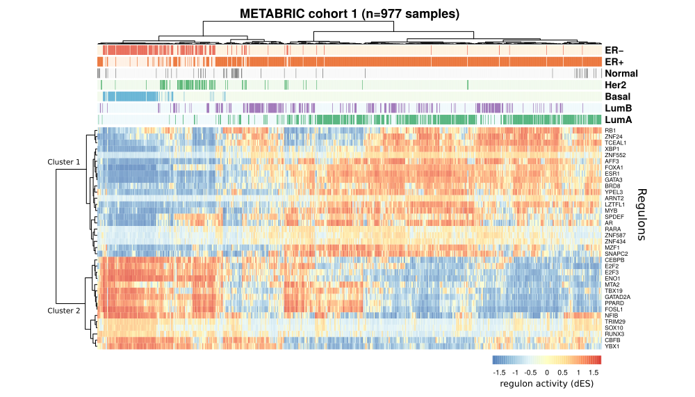
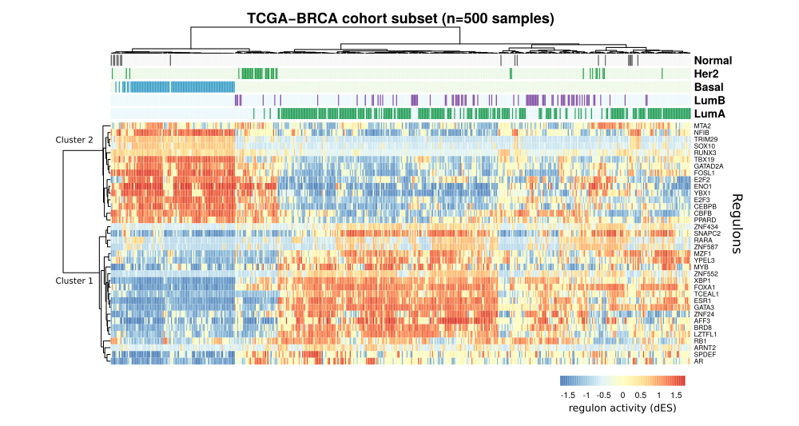

# Overview

The **RTN** package is designed for the reconstruction of TRNs and analysis of regulons using mutual information (MI) [@Fletcher2013]. It is implemented by S4 classes in *R* [@Rcore] and extends several methods previously validated for assessing regulons, *e.g.* MRA [@Carro2010], GSEA [@Subramanian2005], and EVSE [@Castro2016]. The package tests the association between a given TF and all potential targets using either RNA-Seq or microarray transcriptome data. It is tuned to deal with large gene expression datasets in order to build transcriptional regulatory units that are centered on TFs. **RTN** allows a user to set the stringency of the analysis in a stepwise process, including a bootstrap routine designed to remove unstable associations. Parallel data processing is available for steps that benefit from high-performance computing.


# Quick Start


## Transcriptional Network Inference (TNI)

The **TNI** pipeline starts with the generic function `tni.constructor()` and creates a `TNI-class` object, which provides methods for TRN inference from high-throughput gene expression data. The `tni.constructor` takes in a matrix of normalized gene expression and the corresponding gene and sample annotations, as well as a list of regulators to be evaluated. Here, the gene expression matrix and annotations are available in the `tniData` dataset, which was extracted, pre-processed and size-reduced from @Fletcher2013 and @Curtis2012. This dataset consists of a list with 3 objects: a named gene expression matrix (`tniData$expData`), a data frame with gene annotations (`tniData$rowAnnotation`), and a data frame with sample annotations (`tniData$colAnnotation`). We will use this dataset to demonstrate the construction of a small TRN that has only 5 regulons. In general, though, we recommend building regulons for all TFs annotated for a given species; please see the *case study* sections for additional recommendations.

The `tni.constructor` method will check the consistency of all the given arguments. The **TNI** pipeline is then executed in three steps: (i) compute MI between a regulator and all potential targets, removing non-significant associations by permutation analysis; (ii) remove unstable interactions by bootstrapping; and (iii) apply the ARACNe algorithm. Additional comments are provided throughout the examples.

```{r label= 'Load a sample dataset', eval=TRUE}
library(RTN)
data(tniData)
``` 

```{r label='Create a new TNI object', eval=TRUE, results='hide'}
# Input 1: 'expData', a named gene expression matrix (genes on rows, samples on cols); 
# Input 2: 'regulatoryElements', a vector listing genes regarded as TFs
# Input 3: 'rowAnnotation', an optional data frame with gene annotation
# Input 4: 'colAnnotation', an optional data frame with sample annotation
tfs <- c("FOXM1","E2F2","E2F3","RUNX2","PTTG1")
rtni <- tni.constructor(expData = tniData$expData, 
                        regulatoryElements = tfs, 
                        rowAnnotation = tniData$rowAnnotation, 
                        colAnnotation = tniData$colAnnotation)
# p.s. alternatively, 'expData' can be a 'SummarizedExperiment' object
``` 

Then the `tni.permutation()` function takes the pre-processed `TNI-class` object and returns a TRN inferred by permutation analysis (with corrections for multiple hypothesis testing).

```{r label='Permutation', eval=TRUE, results='hide'}
# Please set nPermutations >= 1000
rtni <- tni.permutation(rtni, nPermutations = 100)
``` 

Unstable interactions are subsequently removed by bootstrap analysis using the `tni.bootstrap()` function, which creates a consensus bootstrap network, referred here as `refnet` (reference network).

```{r label='Bootstrap', eval=TRUE, results='hide'}
rtni <- tni.bootstrap(rtni)
``` 

At this stage each target in the TRN may be linked to multiple TFs. Because regulation can occur by both direct (TF-target) and indirect interactions (TF-TF-target), the pipeline next applies the ARACNe algorithm [@Margolin2006a] to remove the weakest interaction in any triplet formed by two TFs and a common target gene, preserving the dominant TF-target pair [@Meyer2008]. The ARACNe algorithm uses the data processing inequality (DPI) theorem to enrich the regulons with direct TF-target interactions, creating a DPI-filtered TRN, referred here as `tnet` (transcriptional network). For additional details, please refer to @Margolin2006b and @Fletcher2013. Briefly, consider three random variables, `X`, `Y` and `Z` that form a network triplet, with `X` interacting with `Z` only through `Y` (*i.e.*, the interaction network is `X->Y->Z`), and no alternative path exists between `X` and `Z`). The DPI theorem states that the information transferred between `Y` and `Z` is always larger than the information transferred between `X` and `Z`. Based on this assumption, the ARACNe algorithm scans all triplets formed by two regulators and one target and removes the edge with the smallest MI value of each triplet, which is regarded as a redundant association.

```{r label='Run DPI filter', eval=TRUE, results='hide'}
rtni <- tni.dpi.filter(rtni)
``` 

For a summary of the resulting regulatory network we recommend using the `tni.regulon.summary()` function. From the summary below, we can see the number of regulons, the number of inferred targets and the regulon size distribution.

```{r label='Check overall summary', eval=TRUE, collapse=TRUE}
tni.regulon.summary(rtni)
``` 

The `tni.regulon.summary()` function also lets us get detailed information about a specific regulon, including the number of positive and negative targets. Please use this information as an initial guide in assessing the set of regulons. Usually small regulons (<15 targets) are not useful for most downstream methods, and highly unbalanced regulons (*e.g.* those with only positive targets) provide unstable activity readouts.

```{r label='Check summary of a regulon', eval=TRUE, collapse=TRUE}
tni.regulon.summary(rtni, regulatoryElements = "FOXM1")
``` 

All results available in the `TNI-class` object can be retrieved using the `tni.get()` accessory function. For example, setting `what = 'regulons.and.mode'` will return a list with regulons, including the weight assigned for each interaction.

```{r label='Check results', eval=TRUE, collapse=TRUE}
regulons <- tni.get(rtni, what = "regulons.and.mode", idkey = "SYMBOL")
head(regulons$FOXM1)
``` 

The absolute value of a weight represents the MI value, while the sign (+/-) indicates the predicted mode of action based on the Pearson's correlation between the regulator and its targets. We can also retrieve the inferred regulons into an `igraph-class` object [@igraph2] using the `tni.graph()` function, which sets some basic graph attributes for visualization in the **RedeR** R package [@Castro2012].

```{r label='Get graph', eval=TRUE}
g <- tni.graph(rtni, regulatoryElements = c("FOXM1","E2F2","PTTG1"))
``` 

The next chunk shows how to plot the `igraph-class` object using **RedeR** (**Figure 1**).

```{r label='Plot graph', eval=FALSE}
library(RedeR)
rdp <- RedPort()
calld(rdp)
addGraph(rdp, g, layout=NULL)
addLegend.color(rdp, g, type="edge")
addLegend.shape(rdp, g)
relax(rdp, ps = TRUE)
``` 


<b>Figure 1.</b> Graph representation of three regulons inferred by the <b>RTN</b> package.


## Transcriptional Network Analysis (TNA)

In the previous section we outlined the **TNI** pipeline, which calculates a TRN and makes information available on its regulons. Here, we describe the **TNA** pipeline, which provides methods for doing enrichment analysis over a list of regulons. The **TNA** pipeline starts with the function `tni2tna.preprocess()`, converting the `TNI-class` into a `TNA-class` object. Then regulons will be tested for association with a given gene expression signature, provided here in the `tnaData` dataset. Note that the dataset in this vignette should be used for demonstration purposes only. It consists of a list with 3 objects: a named numeric vector with log2 fold changes from a differential gene expression analysis, called here a 'phenotype' (`tnaData$phenotype`), a character vector listing the differentially expressed genes (`tnaData$hits`), and a data frame with gene annotations mapped to the phenotype (`tnaData$phenoIDs`).

```{r label='Create a new TNA object (preprocess TNI-to-TNA)', eval=TRUE, results='hide'}
# Input 1: 'object', a TNI object with regulons
# Input 2: 'phenotype', a named numeric vector, usually log2 differential expression levels
# Input 3: 'hits', a character vector, usually a set of differentially expressed genes
# Input 4: 'phenoIDs', an optional data frame with gene anottation mapped to the phenotype
data(tnaData)
rtna <- tni2tna.preprocess(object = rtni, 
                           phenotype = tnaData$phenotype, 
                           hits = tnaData$hits, 
                           phenoIDs = tnaData$phenoIDs)
``` 

The `tna.mra()` function takes the `TNA-class` object and runs the Master Regulator Analysis (MRA) [@Carro2010] over a list of regulons (with corrections for multiple hypothesis testing). The MRA assesses the overlap between each regulon and the genes listed in the `hits` argument.

```{r label='Run the MRA method', eval=TRUE, results='hide'}
# Run the MRA method
rtna <- tna.mra(rtna)
``` 

All results available in the `TNA-class` object can be retrieved using the `tna.get()` accessory function; setting `what = 'mra'` will return a data frame listing the total number of genes in the TRN (`Universe.Size`), the number of targets in each regulon (`Regulon.Size`), the number of genes listed in the `hits` argument (`Total.Hits`), the expected overlap between a given regulon and the 'hits' (`Expected.Hits`), the observed overlap between a given regulon and the 'hits' (`Observed.Hits`), the statistical significance of the observed overlap assessed by the `phyper()` function (`Pvalue`), and the adjusted P-value (`Adjusted.Pvalue`).

```{r label='Get MRA results', eval=TRUE, collapse=TRUE}
# Get MRA results;
#..setting 'ntop = -1' will return all results, regardless of a threshold
mra <- tna.get(rtna, what="mra", ntop = -1)
head(mra)
``` 

As a complementary approach, the `tna.gsea1()` function runs the one-tailed gene set enrichment analysis (GSEA-1T) to find regulons associated with a particular 'response', which is represented by a ranked list of genes generated from a differential gene expression signature (*i.e.* the 'phenotype' included in the TNI-to-TNA preprocessing step). Here the regulon's target genes are considered a gene set, which is evaluated against the phenotype. The GSEA-1T uses a rank-based scoring metric in order to test the association between the gene set and the phenotype [@Subramanian2005].

```{r label='Run GSEA method', eval=TRUE, results='hide'}
# Run the GSEA method
# Please set nPermutations >= 1000
rtna <- tna.gsea1(rtna, nPermutations=100)
``` 

Setting `what = 'gsea1'` in the `tna.get()` accessory function will retrive a data frame listing the GSEA statistics, and the corresponding GSEA plots can be generated using the `tna.plot.gsea1()` function (**Figure 2**).

```{r label='Get GSEA results', eval=TRUE, collapse=TRUE}
# Get GSEA results
gsea1 <- tna.get(rtna, what="gsea1", ntop = -1)
head(gsea1)
``` 

```{r label='Plot GSEA results', eval=FALSE}
# Plot GSEA results
tna.plot.gsea1(rtna, labPheno="abs(log2 fold changes)", ntop = -1)
``` 


<b>Figure 2.</b> GSEA analysis showing genes in each regulon (vertical bars) ranked by differential gene expression analysis (phenotype). This toy example illustrates the output from the **TNA** pipeline evaluated by the `tna.gsea1()` function.

The GSEA-1T, however, does not indicate the direction of the association. Next the **TNA** pipeline uses the two-tailed GSEA (GSEA-2T) approach to test whether the regulon is positively or negatively associated with the phenotype. The `tna.gsea2()` function separates the regulon into positive and negative targets (based on Pearson's correlation between the TF and its targets), and then assesses the distribution of the targets across the ranked list of genes.

```{r label='Run the GSEA-2T method', eval=TRUE, results='hide'}
# Run the GSEA-2T method
# Please set nPermutations >= 1000
rtna <- tna.gsea2(rtna, nPermutations = 100)
``` 

Setting `what = 'gsea2'` in the `tna.get()` accessory function will retrieve a data frame listing the GSEA-2T statistics, and the corresponding GSEA plots can be generated using the `tna.plot.gsea2()` function.

```{r label='Get GSEA-2T results', eval=TRUE, collapse=TRUE}
# Get GSEA-2T results
gsea2 <- tna.get(rtna, what = "gsea2", ntop = -1)
head(gsea2$differential)
``` 

In GSEA-2T (**Figure 3**), a regulon’s positive and negative targets are each considered as separate *pos* and *neg* gene sets, which are then evaluated against the phenotype. For each gene set (*pos* and *neg*) a walk down the ranked list is performed, stepwise. When a gene in the gene set is found, its position is marked in the ranked list. A running sum, shown as the pink and blue (*pos* and *neg* gene sets, respectively) lines, increases when the gene at that position belongs to the gene set and decreases when it doesn’t. The maximum distance of each running sum from the x-axis represents the enrichment score. GSEA-2T produces two per-phenotype enrichment scores (ES), whose difference (dES = ES*pos* - ES*neg*) represents the regulon activity. The goal is to assess whether the target genes are overrepresented among the genes that are more positively or negatively differentially expressed. A large positive dES indicates an induced (activated) regulon, while a large negative dES indicates a repressed regulon. Please refer to @Campbell2016 and @Campbell2018 for cases illustrating the use of this approach; an extension of the GSEA-2T to single samples was implemented by @Castro2016 and @Groeneveld2019.

```{r label='Plot GSEA-2T results', eval=FALSE}
# Plot GSEA-2T results
tna.plot.gsea2(rtna, labPheno="log2 fold changes", tfs="PTTG1")
``` 



<b>Figure 3.</b>  Two-tailed GSEA analysis showing regulon's positive or negative targets (red/blue vertical bars) ranked by differential gene expression analysis (phenotype). This toy example illustrates the output from the **TNA** pipeline evaluated by the `tna.gsea2()` function (@Campbell2016 and @Campbell2018 provide examples on how to interpret results from this method).


# TCGA-BRCA case study


## Context

Here we show how to prepare input data for the **RTN** package using publicly available mRNA-seq data, and clinical/molecular data for the TCGA-BRCA cohort. We show how to download harmonized GRCh38/hg38 data from the Genomic Data Commons (GDC) using the **TCGAbiolinks** package [@Colaprico2016]. The preprocessing will generate a `SummarizedExperiment` object that contains gene expression data, which we will then use to compute BRCA-specific regulons.


## Package and data requirements

Please ensure you have installed all libraries before proceeding.

```{r eval=FALSE}
library(RTN)
library(TCGAbiolinks)
library(SummarizedExperiment)
library(TxDb.Hsapiens.UCSC.hg38.knownGene)
library(snow)
```


## Data preprocessing

We'll use the Bioconductor package **TCGAbiolinks** to query and download from the GDC. We want the GRCh38/hg38 harmonized, normalized RNA-seq data for the TCGA-BRCA cohort. **TCGAbiolinks** will create a directory called GDCdata in your working directory and will save into it the files downloaded from the GDC. The files for each patient will be downloaded in a separate file, and we will use a subset of 500 cases for demonstration purposes only. As a large number of mRNA-seq text files will be downloaded, totaling >140 MB, the download can take a while. Then, the `GDCprepare()` function will compile the files into an R object of class `RangedSummarizedExperiment`. The `RangedSummarizedExperiment` has 6 slots. The most important are `rowRanges` (gene annotation), `colData` (sample annotation), and `assays`, which contains the gene expression matrix.

```{r eval=FALSE}
# Set GDCquery for the TCGA-BRCA cohort
# Gene expression data will be aligned against hg38
query <- GDCquery(project = "TCGA-BRCA",
                  data.category = "Transcriptome Profiling",
                  data.type = "Gene Expression Quantification", 
                  workflow.type = "HTSeq - FPKM-UQ",
                  sample.type = c("Primary solid Tumor"))

# Get a subset for demonstration (n = 500 cases)
cases <- getResults(query, cols = "cases")
cases <- sample(cases, size = 500)
query <- GDCquery(project = "TCGA-BRCA",
                  data.category = "Transcriptome Profiling",
                  data.type = "Gene Expression Quantification", 
                  workflow.type = "HTSeq - FPKM-UQ",
                  sample.type = c("Primary solid Tumor"),
                  barcode = cases)
GDCdownload(query)
tcgaBRCA_mRNA_data <- GDCprepare(query)
```

The object downloaded from the GDC contains gene-level expression data that include both coding and noncoding genes (*e.g.* lncRNAs). We will filter these, retaining only genes annotated in the UCSC hg38 gene list (~30,000 genes).

```{r eval=FALSE}
# Subset by known gene locations
geneRanges <- genes(TxDb.Hsapiens.UCSC.hg38.knownGene)
tcgaBRCA_mRNA_data <- subsetByOverlaps(tcgaBRCA_mRNA_data, geneRanges)
```

```{r eval=FALSE}
nrow(rowData(tcgaBRCA_mRNA_data))
## [1] ~30,000
```

Finally, we'll simplify names in the cohort annotation for better summarizations in the subsequent RTN functions. When this step has been run, the `tcgaBRCA_mRNA_data` object is ready for the *TNI* pipeline. Please ensure that you save the `tcgaBRCA_mRNA_data` object in an appropriated folder.

```{r eval=FALSE}
# Change column names in gene annotation for better summarizations
colnames(rowData(tcgaBRCA_mRNA_data)) <- c("ENSEMBL", "SYMBOL", "OG_ENSEMBL")
```

```{r eval=FALSE}
# Save the preprocessed data for subsequent analyses
save(tcgaBRCA_mRNA_data, file = "tcgaBRCA_mRNA_data_preprocessed.RData")
```


## Inferring the transcriptional regulatory network

Next we will generate regulons for the TCGA-BRCA cohort, following the steps described in the *Quick Start* section. For the regulon reconstruction, we will use a comprehensive list of regulators available in the `tfsData` dataset, comprising 1612 TFs compiled from @Lambert2018. This pipeline should be used on data sets containing at least 100 transcriptome profiles. This represents an empirical lower bound for the ARACNe algorithm [@Margolin2006b].

```{r eval=FALSE}
# Load TF annotation
data("tfsData")
```

```{r eval=FALSE}
# Check TF annotation:
# Intersect TFs from Lambert et al. (2018) with gene annotation 
# from the TCGA-BRCA cohort
geneannot <- rowData(tcgaBRCA_mRNA_data)
regulatoryElements <- intersect(tfsData$Lambert2018$SYMBOL, geneannot$SYMBOL)
```

```{r eval=FALSE}
# Run the TNI constructor
rtni_tcgaBRCA <- tni.constructor(expData = tcgaBRCA_mRNA_data, 
                                 regulatoryElements = regulatoryElements)
```

We can offer some general practical guidance. To compute a large regulatory network we recommend using a multithreaded mode with the **snow** package. As minimum computational resources, we suggest a processor with >= 4 cores and RAM >= 8 GB per core (you should adjust specific routines to suit your available resources). The `makeCluster()` function will set the number of nodes to create on the local machine, making a `cluster` object available for the `TNI-class` methods. For example, it should take ~3h to reconstruct 1600 regulons from a gene expression matrix with ~30,000 genes and 500 samples when running on a 2.9 GHz Core i9-8950H workstation with 32GB DDR4 RAM. Please note that running large datasets in parallel can consume all the system memory. We recommend monitoring the parallelization to avoid working too close to the memory ceiling; the `parChunks` argument available in the `tni.permutation()` and `tni.bootstrap()` functions can be used to adjust the job size sent for parallelization. Finally, for RNA-seq data we recommend using the non-parametric estimator of mutual information (default option of the `tni.permutation()` function).

```{r eval=FALSE}
# Compute the reference regulatory network by permutation and bootstrap analyses.
# Please set 'spec' according to your available hardware
options(cluster=snow::makeCluster(spec=4, "SOCK"))
rtni_tcgaBRCA <- tni.permutation(rtni_tcgaBRCA, pValueCutoff = 1e-7)
rtni_tcgaBRCA <- tni.bootstrap(rtni_tcgaBRCA)
stopCluster(getOption("cluster"))
```

Next we run the ARACNe algorithm with `eps = 0`, which sets the tolerance for removing the edge with the smallest weight in each triplet. For example, the `XY` edge in the `XYZ` triplet is removed if its weight is below `YZ - eps` and `XZ - eps` (see comments in *section 2.1* and the `aracne()` function documentation). Empirically, values between 0 (no tolerance) and 0.15 should be used [@Margolin2006b]. As a less arbitrary approach we suggest setting `eps = NA`, which will estimate the threshold from the null distribution computed in the permutation and bootstrap steps.

```{r eval=FALSE}
# Compute the DPI-filtered regulatory network
rtni_tcgaBRCA <- tni.dpi.filter(rtni_tcgaBRCA, eps = 0)
```

```{r eval=FALSE}
# Save the TNI object for subsequent analyses
save(rtni_tcgaBRCA, file="rtni_tcgaBRCA.RData")
```

The choice of `pValueCutoff` threshold will depend on the desired tradeoff between false positives and false negatives. A sensible `pValueCutoff` threshold can be selected *a priori* by dividing the desired expected number of false positives by the number of tested TF-target interactions [@Margolin2006b]. For example, in this example we tested about 5e+7 TF-target interactions (*i.e.* ~1,600 TFs vs. ~30,000 genes); therefore a `pValueCutoff` threshold of 1e-7 should result in about 5 false positives.

Note that some level of missing annotation is expected, as not all gene symbols listed in the `regulatoryElements` might be available in the TCGA-BRCA preprocessed data. Also, data that are inconsistent with the calculation may be removed in the `tni.constructor` preprocess. For example, if a gene's expression does not vary across a cohort, it is not possible to associate this gene's expression with the expression of other genes in the cohort. As an extreme case, genes that exhibit no variability (*e.g.* that are not expressed in all samples) are excluded from the analysis. For a summary of the resulting regulatory network we recommend using the `tni.regulon.summary()` function (see the *Quick Start* section).

Note also that the MI metric is based on a gene's expression varying across a cohort. Large cohorts of tumour samples typically contain multiple molecular subtypes, and typically provide good expression variability for building regulons. In contrast, sample sets that are more homogeneous may be more challenging to explore with regulons, and this may be the case with sets of normal, non-cancerous samples. We do not recommend computing regulons for sample sets of low expression variability.

## How to select the significance level when inferring regulons from different cohorts

An important challenge in comparing regulatory information for different cohorts is to generate regulons under similar statistical conditions in each cohort. For example, say cohort *A* has gene expression data for 300 samples and *B* for 100 samples. In each cohort, we'd infer regulons with **RTN** by running four sequential steps: `tni.constructor()` to check the input data; `tni.permutation()`, where we'd set a `pValueCutoff` for the mutual information (MI) between expression profiles for pairs of genes; `tni.bootstrap()`, which assesses the stability of MI; and finally `tni.dpi.filter()`, which enhances direct regulator-target interactions. 

If we set a permutation `pValueCutoff = 1e-5` to infer regulons for *A*, what should be our choice of `pValueCutoff` for *B*? The issue here is that the p-value is an inverse function of the sample size; that is, for a smaller cohort we should use a larger (less stringent) p-value. Ideally, sample size for a second cohort should be determined *a priori*, but this is seldom an option, as regulons are typically reconstructed from large retrospective cohort studies.

For RTN regulons, the 'effect size' is the MI value between a regulator and a potential target gene, and our null hypothesis is that the expression profiles for a regulator and a potential target gene have a statistically non-significant relationship; so, for this regulator, the transcriptional network should not retain this target gene. In general, and in RTN's MI permutation calculations, the p-value threshold controls the rate of Type I errors (*i.e.* when we reject a true null hypothesis, creating a false positive result), but it also affects the rate of Type II errors (when we fail to reject a false null hypothesis, creating a false negative result) [@Miller2019]. Type I and Type II error rates are denoted by &alpha; and &beta;, respectively, and the power of a statistical test is defined as 1 - &beta;. Decreasing &alpha; increases &beta; and vice-versa [@Mudge2012]. Because &alpha; determines the power to detect a given effect size, the choice of a `pValueCutoff` makes implicit decisions about &beta;; that is, about the true regulatory interactions that **RTN** will likely consider non-significant, and so will reject. When it comes to assessing the regulatory commonalities between regulons reconstructed from two different cohorts (*e.g.* *A* and *B*), failing to detect a real effect only in *A* should be considered as serious an error as falsely detecting a non-existent effect only in *B*. To minimize the risk of such problems we suggest adjusting &alpha; by looking at the tradeoff between Type I and Type II errors. @Mudge2012 developed R code to calculate optimal &alpha; levels for correlations; we adapted this code by implementing the `tni.alpha.adjust()` function to assist choosing the `pValueCutoff` when analyzing datasets with different numbers of samples.

```{r eval=FALSE}
# For example, to estimate 'alphaB' for 'nB', given 'nA', 'alphaA', and 'betaA'
alphaB <- tni.alpha.adjust(nB = 100, nA = 300, alphaA = 1e-5, betaA = 0.2)
alphaB
# [1] 0.029
```

For the second cohort *B*, we suggest using a value close to `alphaB` for the `pValueCutoff` in the `tni.permutation()` function (and for cohort *A*, `alphaA`), in order that **RTN** will return regulon results that have been generated with similar tradeoffs between Type I and Type II errors for both cohorts.


# METABRIC case study


## Context

@Fletcher2013 reconstructed regulons for 809 transcription factors (TFs) using microarray transcriptomic data from the METABRIC breast cancer cohort [@Curtis2012]. @Castro2016 found that 36 of these TF regulons were associated with genetic risk of breast cancer. The risk TFs were in two distinct clusters. The "cluster 1" risk TFs were associated with estrogen receptor-positive (ER+) breast cancer risk, and included ESR1, FOXA1, and GATA3, whereas the "cluster 2" risk TFs were associated with estrogen receptor-negative (ER-), basal-like breast cancer. Our goal here is to demonstrate how to generate regulon activity profiles for individual tumour samples, using the regulons reconstructed by @Fletcher2013 for the 36 risk TFs.


## Package and data requirements

Please ensure you have installed all libraries before proceeding. The **Fletcher2013b** data package is available from the R/Bioconductor repository. Installing and then loading this package will make available all data required for this case study. The `rtni1st` dataset is a pre-processed `TNI-class` object that includes the regulons reconstructed by @Fletcher2013 and a gene expression matrix for the METABRIC cohort 1 (n=997 primary tumors).

```{r eval=FALSE}
library(RTN)
library(Fletcher2013b)
library(pheatmap)
```

```{r eval=FALSE}
# Load 'rtni1st' data object, which includes regulons and expression profiles
data("rtni1st")
```

```{r eval=FALSE}
# A list of transcription factors of interest (here 36 risk-associated TFs)
risk.tfs <- c("AFF3", "AR", "ARNT2", "BRD8", "CBFB", "CEBPB", "E2F2", "E2F3", "ENO1", "ESR1", "FOSL1", "FOXA1", "GATA3", "GATAD2A", "LZTFL1", "MTA2", "MYB", "MZF1", "NFIB", "PPARD", "RARA", "RB1", "RUNX3", "SNAPC2", "SOX10", "SPDEF", "TBX19", "TCEAL1", "TRIM29", "XBP1", "YBX1", "YPEL3", "ZNF24", "ZNF434", "ZNF552", "ZNF587")
```


## Regulon activity profiles

Regulon activity profiles (RAPs) characterize regulatory program similarities and differences between samples in a cohort. In order to assess a large number of samples, we implemented a function that computes the two-tailed GSEA for an entire cohort (additional details are provided in @Groeneveld2019). Briefly, for each regulon, the `tni.gsea2()` function estimates a regulon activity score for each sample available in the `TNI-class` object. For each gene in a sample, a differential gene expression is calculated from its expression in the sample relative to its average expression in the cohort; the genes are then ordered as a ranked list representing a differential gene expression signature in that sample, which is used to run the GSEA-2T as explained in `tna.gsea2` method (see *section 2.2*).

```{r eval=FALSE}
# Compute regulon activity for individual samples
rtni1st <- tni.gsea2(rtni1st, regulatoryElements = risk.tfs)
metabric_regact <- tni.get(rtni1st, what = "regulonActivity")
```

The `tni.gsea2` returns a list with the calculated enrichment scores: ES*pos*, ES*neg* and dES, which represents the regulon activity of individual samples. Next, the **pheatmap** package is used to generate a heatmap showing RAPs along with some sample attributes (**Figure 4**).

```{r eval=FALSE}
# Get sample attributes from the 'rtni1st' dataset
metabric_annot <- tni.get(rtni1st, "colAnnotation")
# Get ER+/- and PAM50 attributes for pheatmap
attribs <- c("LumA","LumB","Basal","Her2","Normal","ER+","ER-")
metabric_annot <- metabric_annot[,attribs]
```

```{r eval=FALSE}
# Plot regulon activity profiles
pheatmap(t(metabric_regact$dif), 
         main="METABRIC cohort 1 (n=977 samples)",
         annotation_col = metabric_annot, 
         show_colnames = FALSE, annotation_legend = FALSE, 
         clustering_method = "ward.D2", fontsize_row = 6,
         clustering_distance_rows = "correlation",
         clustering_distance_cols = "correlation")
```

```{r eval=FALSE, include=FALSE}
pheatmap(t(metabric_regact$dif), 
         main="METABRIC cohort 1 (n=977 samples)", 
         treeheight_row = 40, treeheight_col = 20,
         annotation_col = metabric_annot, 
         show_colnames = FALSE, annotation_legend = FALSE, 
         clustering_method = "ward.D2",
         clustering_distance_rows = "correlation",
         clustering_distance_cols = "correlation", 
         fontsize_row = 6, height = 5, width = 9,
         filename = "fig4.pdf")
```



<b>Figure 4.</b> Regulon activity profiles of individual tumour samples from the METABRIC cohort 1 (for an example where this approach has been used, please see Figures 4A and 5A from @Robertson2017).

# Assessing samples with regulons calculated from a different cohort

You may want to assess transcriptome data for a set of samples from cohort B against regulons that you have previously calculated for cohort A. For example, cohort A may be large enough to support inferring regulons, while cohort B may be too small for these calculations. Alternatively, you may wish to compare regulon results between two cohorts (see **Figures 4** and **5**).

The `tni.replace.samples()` function is the entry point for assessing new samples with previously calculated regulons. This function will require an existing `TNI-class` object from cohort A, whose gene expression matrix and sample annotation will be replaced by cohort B. The `tni.replace.samples` will check all the given arguments, particularly the consistency of gene annotations between the two datasets. Next we show how to generate RAPs for TCGA-BRCA samples using the regulons reconstructed for METABRIC cohort 1 by @Fletcher2013.

```{r eval=FALSE}
# Replace samples
rtni1st_tcgasamples <- tni.replace.samples(rtni1st, tcgaBRCA_mRNA_data)
```

```{r eval=FALSE}
# Compute regulon activity for the new samples
rtni1st_tcgasamples <- tni.gsea2(rtni1st_tcgasamples, regulatoryElements = risk.tfs)
tcga_regact <- tni.get(rtni1st_tcgasamples, what = "regulonActivity")
```

```{r eval=FALSE}
# Get sample attributes from the 'rtni1st_tcgasamples' dataset
tcga_annot <- tni.get(rtni1st_tcgasamples, "colAnnotation")
# Adjust PAM50 attributes for pheatmap
tcga_annot <- within(tcga_annot,{
  'LumA' = ifelse(subtype_BRCA_Subtype_PAM50%in%c("LumA"),1,0)
  'LumB' = ifelse(subtype_BRCA_Subtype_PAM50%in%c("LumB"),1,0)
  'Basal' = ifelse(subtype_BRCA_Subtype_PAM50%in%"Basal",1,0)
  'Her2' = ifelse(subtype_BRCA_Subtype_PAM50%in%c("Her2"),1,0)
  'Normal' = ifelse(subtype_BRCA_Subtype_PAM50%in%c("Normal"),1,0)
})
attribs <- c("LumA","LumB","Basal","Her2","Normal")
tcga_annot <- tcga_annot[,attribs]
```

```{r eval=FALSE}
# Plot regulon activity profiles
pheatmap(t(tcga_regact$dif), 
         main="TCGA-BRCA cohort subset (n=500 samples)",
         annotation_col = tcga_annot, 
         show_colnames = FALSE, annotation_legend = FALSE, 
         clustering_method = "ward.D2", fontsize_row = 6,
         clustering_distance_rows = "correlation",
         clustering_distance_cols = "correlation")
```

```{r eval=FALSE, include=FALSE}
pheatmap(t(tcga_regact$dif), 
         main="TCGA-BRCA cohort subset (n=500 samples)",
         treeheight_row = 40, treeheight_col = 20,
         annotation_col = tcga_annot, 
         show_colnames = FALSE, annotation_legend = FALSE, 
         clustering_method = "ward.D2",
         clustering_distance_rows = "correlation",
         clustering_distance_cols = "correlation", 
         fontsize_row = 6, height = 4.5, width = 9,
         filename = "fig5.pdf")
```


<b>Figure 5.</b> Regulon activity profiles of individual tumour samples for a subset (n=500) of the TCGA-BRCA cohort using regulons reconstructed by @Fletcher2013 (for an example where this approach has been used, please see Figure S7A-F from @Corces2018).

The unsupervised hierarchical clustering in **Figure 5** is obtained using RAPs from 500 samples of the TCGA-BRCA cohort for the set of 36 regulons calculated from the METABRIC cohort 1. Despite the different cohorts, and different technologies used to quantify gene expression on these cohorts (TCGA used RNA-seq, while METABRIC used microarrays), the luminal, basal and Her2 covariate tracks indicate that the RAPs in **Figures 4** and **5** return similar clustering structure.

# Citation

The RTN, RTNsurvival and RTNduals packages provide methods that were implemented by the authors and contributors. When using these packages in publications, please cite the appropriate papers that introduced the methods and analysis pipelines.

<u>When using the TNI and TNA analysis pipelines:</u>

* Fletcher MNC *et al.*, Master regulators of FGFR2 signalling and breast cancer risk. *Nature Communications*, 4:2464, 2013. doi: [10.1038/ncomms3464](https://doi.org/10.1038/ncomms3464)

<u>When using the GSEA-2T method to estimate regulon activity:</u>

* Castro MAA *et al.*, Regulators of genetic risk of breast cancer identified by integrative network analysis. *Nature Genetics*, 48(1):12-21, 2016. doi: [10.1038/ng.3458](https://doi.org/10.1038/ng.3458)

* Campbell TM *et al.*, FGFR2 risk SNPs confer breast cancer risk by augmenting oestrogen responsiveness. *Carcinogenesis*, 37(8):741-750, 2016. doi: [10.1093/carcin/bgw065](https://doi.org/10.1093/carcin/bgw065)

<u>When using RAPs to characterize regulatory similarities and differences between samples in a cohort:</u>

* Robertson AG *et al.*, Comprehensive Molecular Characterization of Muscle-Invasive Bladder Cancer. *Cell*, 171(3):540-556, 2017. doi: [10.1016/j.cell.2017.09.007](https://doi.org/10.1016/j.cell.2017.09.007)

* Corces MR *et al.*, The chromatin accessibility landscape of primary human cancers. *Science*, 362(6413):eaav1898, 2018. doi: [10.1126/science.aav1898](https://doi.org/10.1126/science.aav1898)

<u>When using the EVSE method to explore regulators of genetic risk:</u>

* Castro MAA *et al.*, Regulators of genetic risk of breast cancer identified by integrative network analysis. *Nature Genetics*, 48(1):12-21, 2016. doi: [10.1038/ng.3458](https://doi.org/10.1038/ng.3458)

<u>When using the conditional mutual information analysis pipeline to explore modulators of transcription factors:</u>

* Campbell TM *et al.*, Identification of Post-Transcriptional Modulators of Breast Cancer Transcription Factor Activity Using MINDy. PLoS ONE 11(12):e0168770, 2016. doi: [10.1371/journal.pone.0168770](https://doi.org/10.1371/journal.pone.0168770)

<u>When using the survival analysis pipeline to integrate RAPs with clinical variables:</u>

* Groeneveld CS *et al.*, RTNsurvival: An R/Bioconductor package for regulatory network survival analysis. *Bioinformatics*, btz229, 2019. doi: [10.1093/bioinformatics/btz229](https://doi.org/10.1093/bioinformatics/btz229)

<u>When using the dual-regulon analysis pipeline to search for co-regulatory associations between pairs of regulators:</u>

* Chagas VS *et al.*, RTNduals: An R/Bioconductor package for analysis of co-regulation and inference of dual regulons. *Bioinformatics*, btz534, 2019. doi: [10.1093/bioinformatics/btz534](https://doi.org/10.1093/bioinformatics/btz534)


# Session information

```{r label='Session information', eval=TRUE, echo=FALSE}
sessionInfo()
```

# References
